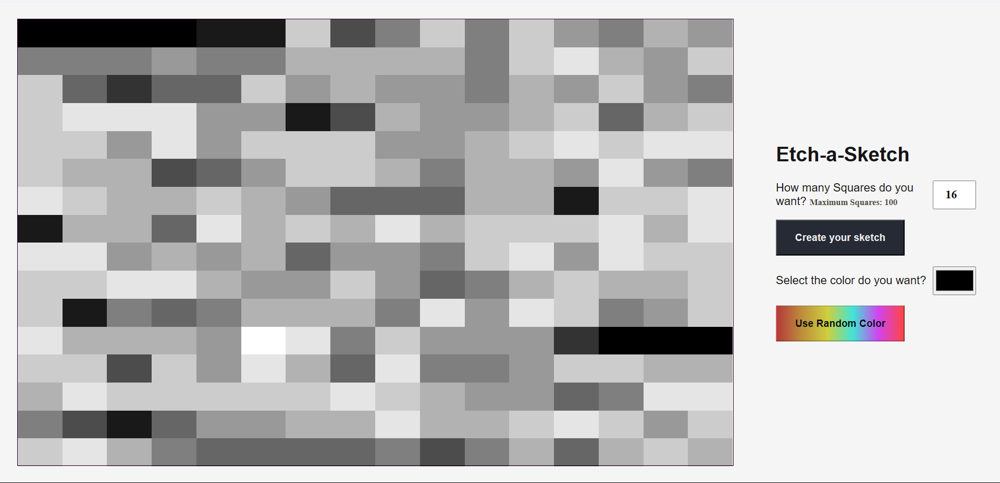

# Etch a Sketch

## Preview

[**Crea tus propios dibujos**](https://etch-a-sketch-rouge.vercel.app/)

## Features

[x] Create a 16x16 board at the load of the webpage (*using JavaScript and not HTML*)

[x] Put the board in a container

[x] When the user pass the mouse in a square, this change her color (*Put a randomizer RGB for the color*)

[x] The change color can be proggresive

[x]  Put a form so that  the user can create his own board

[ ] Add a functionality to put random colors with the button use random color

***Use css flebox*** don't use **css grid**